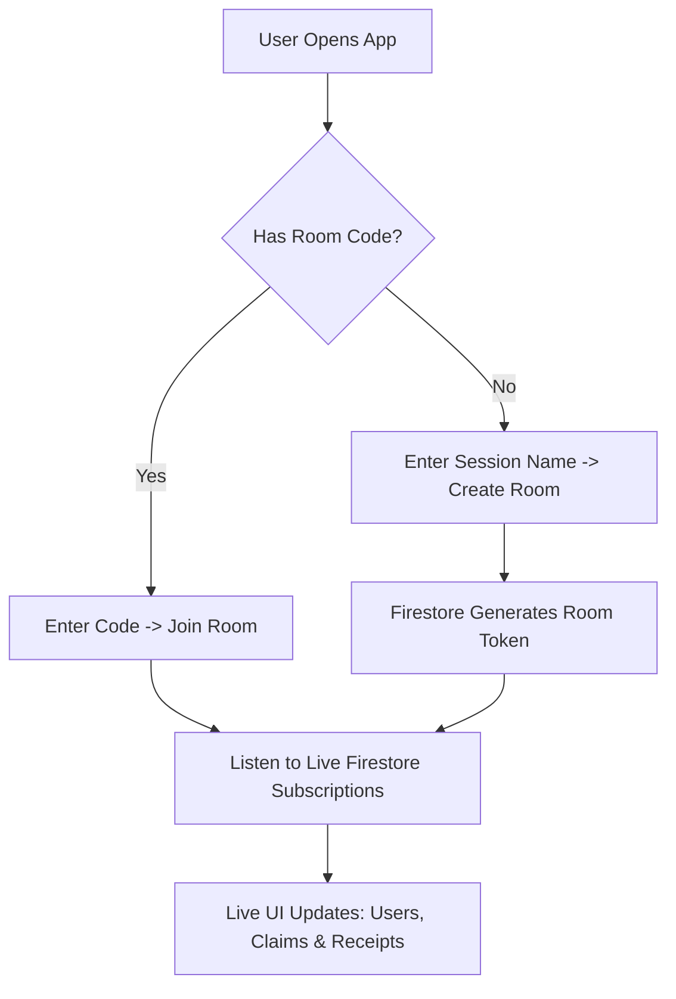

# Bagi Duit Lah Bang — Technical Documentation

## 1. Planning & Approach
The core objective of **Bagi Duit Lah Bang** was to build a frictionless, zero-signup-required utility app to solve the real-world problem of messy bill splitting. 

The application was approached using an **iterative prototype strategy**:
* **Phase 1: Prototyping & Idea Collection** – The project was inspired by the concept of an instantaneous room code generation function. The goal was to eliminate traditional user registration friction, allowing a group to spin up a collaborative session instantly (Inspiration from Quizziz room codes).
* **Phase 2: Mathematical Logic Planning** – Before writing any UI code, the core algorithmic architecture was planned out. This ensured the ledger logic could accurately distribute shared costs with complex tax multipliers and optimize multi-party debts down to precision-accurate peer-to-peer transfer amounts.
* **Phase 3: Database Schema Design (Firestore)** – Built a highly reliable Cloud Firestore NoSQL schema. The data models were structured to handle multi-user race conditions seamlessly, ensuring room details, live participants, orders, and claiming arrays are stored perfectly.
* **Phase 4: AI Integration (Gemini Flash)** – Layered on artificial intelligence by integrating Gemini Flash. This transformed the application from a manual checklist tool into an automated scanner capable of reading unstructured receipt images and converting them into strict digital data.

---

##  2. Tool & Framework Justifications

* **Next.js (React):** Chosen for its robust structure and built-in API routes. This allowed us to build the backend logic for parsing receipt images right alongside our user interface without spinning up a separate server.
* **Tailwind CSS:** Crucial for rapid prototyping. Its utility-first layout approach allowed for immediate UI adjustments and native support for modern high-definition styling requirements.
* **Firebase Firestore:** Selected over traditional relational databases because bill-splitting is inherently a live, collaborative event. Firestore’s native WebSocket-based real-time data sync allows users to watch items get claimed by their friends in real-time with zero lag.
* **Google Gemini AI:** Used to build the scanning feature. Traditional OCR engines only read raw text, requiring complex regex string manipulation to find prices. Gemini understands the *context* of a receipt, allowing it to instantly identify what constitutes a line item, an SST fee, or a discount.

---

##  3. Main Technical Decisions & Architecture Overview
To maintain an architectural standard of **high cohesion and low coupling**, the application structure isolates business logic from rendering layouts:

* **State Orchestration (`src/app/page.tsx`):** Acts as the central "traffic cop" or router. It maintains the core state machines (`activeRoom`, `participants`, `orders`) and determines which view wrapper to display.
* **Real-Time Data Layer (`src/lib/roomOps.ts`):** Contains pure database transactions. No UI code lives here. It handles state mutations safely inside Firebase transactions.
* **Decoupled Components (`src/components/`):** View layers are explicitly separated into isolated modules (`AuthScreen`, `DashboardScreen`, `SummaryScreen`). This guarantees that minor typing inputs inside a form do not force heavy re-renders across the rest of the application tree.

---

##  4. Key Feature Flows (System Flowcharts)

### Room Lifecycle & Real-Time Synchronization Flow

##  5. Tech Stack Summary

| Layer | Technology Used | Purpose |
| :--- | :--- | :--- |
| **Frontend** | React / Next.js (App Router) | Core Application Core & Layout Routing |
| **Styling** | Tailwind CSS / Tailwind-Animate | High-Contrast Fluid Layouts & Micro-animations |
| **Database** | Firebase Firestore | Real-time Synchronization Ledger |
| **Authentication** | Firebase Auth | Google OAuth & Anonymous Session Lifecycles |
| **AI Processing** | Google Gemini API (Flash) | Computer Vision Receipt Extraction |
| **Graphics** | `html-to-image` | Client-side DOM Image Export Generation |
